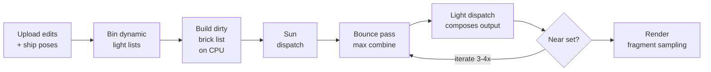

# Ray-Traced Voxel Lighting — Design

2026-09-18 · @Someone

## Overview

All lighting comes from rays traced through voxel occupancy: sun, every point light, and short bounce/AO rays. Light is stored per air voxel and sampled by the fragment shader. There is no flood fill, no shadow map and no per-grid special case. The world and every airship are voxel grids with a rigid transform, and a ray walks each grid in that grid's own voxel space.

**Goals**

- Blocky, Minecraft-style lighting with 16 levels per RGB channel.
- Light and shadow cross between the world and 3–4 freely rotating airship grids, in both directions.
- Every player-placed light casts real directional shadows. The player controls placement, so there is no light-count cap.
- No leaking through one-block walls, which airship hulls are full of.
- Runs on WebGPU (WGSL compute, no hardware RT, no bindless) with a 16-chunk view radius of 32³ chunks.

**The system at a glance**

| Part | What it is |
| --- | --- |
| Scene | World and ship grids; 1-bit occupancy in 4 KB chunk slots of one pooled buffer, found through a lookup table |
| Tracer | Any-hit DDA over all grids: slab-test ship boxes, walk each grid in local space, then the world |
| Light storage | 16 bits per surface air voxel (RGB 4-bit each + 1-bit sun visibility + 3-bit AO), addressed through a flat 8³-brick table; slots per brick, per chunk in the fallback mode |
| Direct light | One sun ray and one shadow ray per in-range light, per surface air voxel |
| Indirect light | 2–4 short (≤16 block) rays per voxel per frame into a persistent 4 B accumulator (EMA to start, max available as a switch); AO is an 8-bit hit count accumulated after each re-mesh |
| Ambient | A uniform constant, scaled by AO |
| Updates | Dirty-region driven; a moving ship and everything it touches is recomputed every frame |
| Rendering | Fragment samples the air voxel in front of its face; greedy meshing stays light-independent |

## Scene representation

Occupancy is one bit per voxel ("does this block stop light"), stored in fixed 4 KB slots of a single pooled storage buffer shared by the world and every ship. One buffer means one binding, no per-ship bind groups, no cap on ship count and no copying.

**Grids**

- The world is chunked into 32³ chunks. Each ship is its own grid of chunks in ship-local coordinates, plus a rigid transform (rotation + translation, no scale) and an oriented bounding box.
- Each grid has a GPU descriptor: world→local and local→world matrices, its chunk dimensions, and the offsets of its chunk and brick table sections.
- Rigid transforms preserve distance, so a ray parameter `t` means the same distance in every grid.

**Occupancy slot layout (4 KB per chunk)**

- 512 bricks of 4³ voxels. Each brick is 64 bits, stored as a `vec2<u32>` because WGSL has no `u64`.
- Bricks are laid out brick by brick so one brick is two adjacent words.
- A 512-bit summary (16 `u32`, one bit per non-empty brick) sits beside the slot for skipping.

**Lookup tables**

All tables live in one table buffer, split into sections. Each grid's descriptor holds two offsets — `tableBase` for its chunk section and `brickBase` for its brick section — so a chunk lookup is `tables[grid.tableBase + localChunkIndex]` and a light lookup is `tables[grid.brickBase + localChunkIndex × 64 + brickIndex]`.

- **World section (offset 0):** a toroidal table around the camera, fixed at 33 × H × 33 entries; `localIndex` wraps `chunkCoord mod (33, H, 33)`. WGSL `%` truncates toward zero, so use `((c % N) + N) % N`. **Range-check the chunk coordinate before every lookup.** Wrapping means an out-of-range coordinate aliases onto a real loaded chunk on the opposite side of the camera, so a ray that leaves the loaded area reports a phantom hit instead of finding `UNLOADED` — long sun rays and rays in caves hit this regularly. Test `all(abs(chunkCoord - cameraChunk) <= 16)`, plus the vertical extent if H is shorter than the world, and treat a failure exactly like `UNLOADED`. This section never moves or resizes.
- **Ship sections:** a dense pair of tables per ship, one fixed size (for example 8×8×8 chunks = 512 chunk entries × 4 B = 2 KB, plus 32k brick entries × 4 B = 128 KB) handed out from a free list like the pools. If ships can outgrow that, use power-of-two size classes; a ship that grows gets bigger sections, its tables are written there, and only its two base offsets change.
- **Chunk entry** `{occupancySlot}`, one `u32`:
  - `occupancySlot` is a slot index or a sentinel: `ALL_AIR`, `ALL_SOLID` or `UNLOADED`. Uniform chunks never take a slot, and a ray crosses them in one step. Unloading writes `UNLOADED` so a wrapped entry can never alias a stale slot.
  - **Light is not in this entry.** It used to carry a `lightTableSlot` beside the occupancy slot; the light path now goes through its own flat brick table (below) and never reads the chunk entry at all. The chunk level survives here for the tracer alone, where `ALL_AIR` is worth a whole 32-block step.
- **Brick light table:** one flat `u32` per 8³ brick over the same toroidal space, in its own section of the table buffer, addressed as `brickTable[grid.brickBase + localChunkIndex × 64 + brickIndex]`. The chunk's run of 64 is computed rather than fetched, so the light path is grid → brick entry → slot → voxel: one dependent load shorter than routing through the chunk entry, on the hottest read in the system (every fragment, every bounce hit). Entries are filled for every chunk in the volume, sky and deep rock included — a sentinel run is 256 B and buys a lookup with no residency check and no branch before the fetch. The world section is 33 × H × 33 × 64 × 4 B ≈ 2.2 MB at H = 8; a ship section of 8×8×8 chunks is 128 KB. Two consequences: residency is now written in two places, so load, unload and edit write both tables in the same `writeBuffer` and each stays authoritative for one consumer (chunk table for the tracer, brick table for the light path, never cross-read); and the toroidal range check still applies, at brick granularity, because a wrapped coordinate lands on a real entry rather than a sentinel.

**Pool management**

- CPU free list of slot indices. Load: pop a slot, `writeBuffer` 4 KB, write the chunk entry and the chunk's 64 brick entries in the same write. Unload: push the slot, write the sentinels into both.
- Every slot is the same size, so there is no fragmentation and the pool never reallocates in normal play.
- Moving across a chunk boundary rewrites one wrapped slab of the table (about 33 × H entries).
- `writeBuffer` is ordered on the queue timeline, so a slot freed and reused in the same frame cannot corrupt an in-flight dispatch.
- If the pool fills, evict the farthest chunk. Growing the buffer (copy to a bigger one, rebuild bind groups) is a rare fallback with a one-frame hitch.
- Ship chunks are allocated when the ship spawns and stay resident.

**Edits:** re-upload the 4 KB slot and its summary, and switch between slot and sentinel if the chunk became (or stopped being) uniform.

**Binding layout**

WebGPU's default `maxStorageBuffersPerShaderStage` is 8, and the system has about nine logical buffers, so small ones are packed together. The engine already requests the adapter's full limits, but the packed layout keeps weaker adapters working too.

| Binding | Contents |
| --- | --- |
| Occupancy pool | 4 KB occupancy + 64 B brick summary per slot |
| Metadata | Grid descriptors, table sections, light lists, each at a known offset |
| Lights | Light buffer (position, grid, colour, radius) |
| Light pool (both regions) | One buffer, two regions: packed `u16` light (1 KB per brick, or 64 KB per chunk in the fallback), then the 4 B accumulation words at `bounceBase` (2 KB per brick) |
| Work list | Dirty bricks for this frame's passes |

That is 5 storage buffers per stage, plus a small uniform for per-frame constants (sun direction, frame index).

## Light storage

Light lives in the air voxel in front of each face, 16 bits per voxel, stored only where faces can sample it. Every lookup is brick-granular through the flat brick table, and storage is laid out brick-major so a brick's 512 voxels are always one contiguous 1 KB run. Slots are allocated **per brick from the start** (about 20–60 MB). Chunk-granular allocation — one 64 KB slot per chunk that has any surface at all, about 130–200 MB — is kept as a fallback and a debug mode rather than a first phase: the two differ only in the allocator's predicate (`mask != 0` against bit *i* of the mask), the mesher already produces that mask for the dirty list, and no shader can tell them apart.

**Packed format (u16)**

| Bits | Field | Meaning |
| --- | --- | --- |
| 0–3 | R | Direct and bounce, combined per channel, red, 16 levels |
| 4–7 | G | Green, 16 levels |
| 8–11 | B | Blue, 16 levels |
| 12 | Sun | Sun visibility, lit or shadowed; N·L is applied in the fragment shader |
| 13–15 | AO | Accumulated AO hit count quantized to 8 levels; scales the uniform ambient |

- RGB levels are stored on a nonlinear (roughly exponential) curve and decoded through a 16-entry lookup table in the fragment shader. Sixteen linear steps band badly in the darks.
- **Sun is one bit** because it is one hard ray: the result is lit or not, so extra bits would go unused. Storing visibility only (not radiance) works because the sun direction is a single uniform, so N·L per face is exact. That also avoids the shared-direction problem for the brightest light.
- **Ray AO takes the 3 freed bits.** Eight levels is enough for a darkening factor on a uniform ambient in a blocky style. The field is the accumulator's open-face hit fraction, quantized, so the three bits are accurate even though they are coarse. Decode as `level / 7`. Static corner AO is separate and not stored here: it is per-face geometry, computed at mesh time and carried in the vertex data.
- Ambient stays a runtime uniform, so a day cycle can change its brightness or tint without relighting anything.
- If soft sun edges from several jittered rays are wanted later, split the top 4 bits 2/2 (4 sun levels, 4 AO levels) instead.
- WGSL storage has no `u16`: two voxels are packed per `u32`.

**Why sparse.** Faces only sample surface air voxels (air touching a solid). A dense 32³ chunk is 64 KB of light, and most of every chunk is rock or sky that no face reads.

| Storage layout | Chunks or bricks stored | Light memory |
| --- | --- | --- |
| Dense, view circle × 8 chunks tall (804 × 8) | ≈ 6.4k chunks | ≈ 410 MB |
| Dense, view circle × 12 chunks tall | ≈ 9.6k chunks | ≈ 620 MB |
| Dense, full toroidal square (33 × 33 × 8) | ≈ 8.7k chunks | ≈ 560 MB |
| **Chunk-granular (fallback)** | ≈ 2–3k non-uniform chunks | **≈ 130–200 MB** |
| **Brick-granular (default)** | ≈ 19k–60k bricks | **≈ 20–60 MB** |

Fully dense also exceeds WebGPU's default 128 MiB `maxStorageBufferBindingSize`, so it would need a raised limit or several bindings.

**Brick-granular allocation (the default)**

- Split each chunk into 64 bricks of 8³. Only bricks containing a surface air voxel get a 1 KB slot (512 voxels × 2 B, two voxels per `u32`).
- Nothing in any shader changes. The same brick entry now holds a 1 KB slot allocated on its own account rather than a run inside a chunk slot, or `NO_SURFACE`. The difference is an allocator and free-list change, not a lookup change — which is why per-brick allocation is the default from the start instead of a later phase.
- Example: a hillside chunk has 10–16 of its 64 bricks crossed by the surface, so it stores 10–16 KB instead of 64 KB.
- 8³ balances table overhead (4³ means 8× more table entries and slots) against waste (16³ bricks are mostly unused rock and air).

**Chunk-granular allocation (fallback and debug mode)**

- Each chunk containing at least one surface air voxel gets a fixed 64 KB slot in a light pool (32³ voxels × 2 B), laid out **brick-major**: 64 runs of 1 KB, the same ordering occupancy chunks already use. Chunks with none (all rock, all sky) get `NONE` and cost nothing.
- The chunk's 64 brick entries point at the 64 runs inside its slot, so the lookup is brick entry → slot → voxel — the same path step 2 uses. Bricks with no surface voxel get `NO_SURFACE` even though their run is allocated; the waste is the price of one allocation per chunk.
- Same free-list scheme as the 4 KB occupancy slots. About 130–200 MB fits comfortably on desktop GPUs once the adapter's real limits are requested, but it is tight on integrated graphics.

In either mode, a lookup that finds `NONE` or `NO_SURFACE` returns ambient only. Nothing should sample there, but a face briefly can while its chunk is being re-meshed.

**Management (CPU)**

The CPU owns allocation, because everything that changes which chunks or bricks need storage already happens there: meshing, edits, loads and unloads. The GPU only reads the tables and writes light into slots it was given.

- **CPU state:** a free-list stack of slot indices; per chunk, a copy of its 64 brick entries as last uploaded, plus whatever backs them (one 64 KB chunk slot in step 1, up to 64 brick slots in step 2); per slot, its owner, for eviction and debugging.
- **After a chunk is meshed:** the mesher already walks exposed faces, so it also records which chunk (or which bricks) contain surface air voxels. Diff against the previous state: pop slots for new needs, push slots that are no longer needed, upload the changed table with `writeBuffer`, and queue new storage as high-priority dirty.
- **Unload:** push every slot back and write `NONE`.
- **Clearing reused slots:** a popped slot still holds its previous owner's light. Fill it with "ambient only" (`writeBuffer` or a small GPU fill) on allocation so no face flashes another chunk's light before it is relit.
- **Ordering:** frees, reuses and clears are queued writes, ordered with dispatches on the queue timeline, so a slot can't be reused while an earlier dispatch still reads it.

**Sizing**

- **Chunk-granular:** capacity ≈ expected non-uniform chunks × 1.5 headroom, about 3–4.5k slots. A chunk slot is 64 KB of light plus 128 KB of accumulation, so it lands at 580–860 MB — fine for a debug session at a reduced view radius, not for normal play.
- **Brick-granular:** the view area is about 820k block columns ÷ 64 ≈ 12.8k brick columns; × 1.5 for steps and brick-boundary crossings ≈ 19k bricks; × 2–3 headroom for caves, overhangs, islands and builds ≈ 40–60k slots. A slot is 1 KB of light plus 2 KB of accumulation, so the buffer is 3 KB per slot: 120–180 MB allocated, 57–180 MB in use.
- Compute capacity from the view radius at startup and clamp it to the adapter's reported `maxStorageBufferBindingSize` and `maxBufferSize`. The engine requests the adapter's full limits, so the spec defaults are not the ceiling — even the chunk-granular fallback's 200–290 MB is comfortable on a desktop adapter. Log the high-water mark in real worlds and tune the headroom from that.
- **Out of slots:** free the farthest chunks' storage first; they show ambient only until space frees up. Growing the pool (copy to a bigger buffer, rebuild bind groups) is a rare fallback with a one-frame hitch.

**Accumulation region (bounce, AO, sun)**

Bounce and AO have to survive between frames; direct light and the sun bit do not. So bounce and the AO count live in a persistent accumulation region of 4 B per voxel, sparse on the same bricks as light and reached through the same slot. It sits in the same buffer as the light region at a fixed offset (`bounceBase`), so it costs no extra binding, and it is a separate region rather than an interleaved field so the fragment shader's cache lines stay pure light — the fragment never reads it. Keeping bounce in a field of its own, rather than fused with direct at 4 bits, is what removes seeding: re-dirtying a brick no longer has to reconstruct the old bounce by subtraction. Eight bits per channel is more headroom than either combine rule needs, deliberately: it leaves the choice between max and an EMA a one-line switch rather than a re-layout. The sun bit is not here: the sun dispatch writes it straight into the light word (see below).

| Bits | Field | Meaning |
| --- | --- | --- |
| 0–7 | Bounce R | Accumulated indirect, 8-bit linear |
| 8–15 | Bounce G | Green |
| 16–23 | Bounce B | Blue |
| 24–31 | AO count | Hits among the open-face AO rays traced since the last re-mesh, at most 126 |

4 B per voxel, so 2 KB per 8³ brick — twice the light region, in the same buffer, addressed by the same slot.

- **No transient pool and no pack pass.** The accumulation region is persistent and sparse on the same bricks as light, so there is no scratch allocator, no retention window, no eviction question and no quantize-at-the-end step.
- **Word ownership.** Each voxel owns its 4 B accumulation word outright; the light region packs two voxels per `u32`, so every dispatch uses the same mapping — 256 threads per brick, thread *i* taking voxels 2*i* and 2*i*+1 — and each thread writes whole words it owns in both regions. **The rule is one writer per word per pass**, with passes separated by barriers; no read-modify-write race exists anywhere, so no pass is needed to serialize one.
- **Direct light never reaches memory.** It is summed in registers by the thread that owns the voxel and composed into the output word in the same dispatch.
- **Two passes write the light region, in sequence.** The sun dispatch writes bit 12 of the words it owns; the light dispatch later reads each word, keeps its sun bit, combines direct with the stored bounce, quantizes the AO count to the 3-bit field, and writes the word back.

**Direction is shared.** One voxel's light serves every face around it, so at a floor–wall corner both faces get the same point-light value. This is the Minecraft look and reads well for blocky art. If a case looks wrong later, per-voxel L1 spherical harmonics (4 coefficients) fixes it at about 4× the memory.

## Lights and light lists

Each chunk has a list of the lights whose sphere reaches it, so a voxel only tests the few lights near its chunk instead of every light in the world. This is clustered shading with the chunk as the cluster.

**Light buffer** (one entry per light): position in its owning grid's local space, owning grid index, RGB colour, radius (16 by default). Light blocks are excluded from the occupancy mask, so a lamp never shadows itself.

**Binning.** A light's radius box is converted to chunk coordinates of the target grid and its index is written into every overlapped chunk. With radius 16 and 32³ chunks, a light touches at most 8 chunks per grid.

**Compact list build** (no cap, no overflow), three passes:

1. **Count:** one thread per light atomically increments the count of each chunk it overlaps.
2. **Prefix sum:** counts become offsets into one flat `lightIndices[]` array.
3. **Fill:** each light writes its index into each chunk's range.

**Two sets of lists**

| Set | Contents | Rebuilt |
| --- | --- | --- |
| Static | World lights binned into world chunks | When a light is placed or removed, or a chunk loads |
| Dynamic | Ship lights binned into world chunks (at the ship's current pose); world lights binned into ship chunks (transformed into ship space); ship lights binned into other ships' chunks | Every frame from scratch |

Only lights on or near ships are dynamic, a few dozen to a few hundred, so the per-frame rebuild costs microseconds. A ship's own lights on its own chunks are binned once, in ship space, into the static set for that ship.

For a ship voxel, light positions are transformed into ship space before the shading loop, so the per-voxel loop body is identical for world and ship voxels.

## Ray traversal

Shadow, sun and AO rays only ask whether anything blocks them, so each grid is traced independently and the ray stops at the first hit in any grid. No parallel or lockstep traversal is needed. A ray starts in the space of the voxel that cast it — world space for a world voxel, ship-local for a ship voxel — so it is lifted to world space once and pushed from there into each other grid; the source grid is traced in its own space with no transform at all. Rigid transforms preserve distance, so `tEnd` and every `t` compare directly across grids.

```
// p, d are in src's space: the world grid, or the ship the voxel belongs to
bool traceOccluded(src, p, d, tEnd):
    pw = src.toWorld(p);  dw = src.rotToWorld(d)   // identity when src is the world
    for g in ships:                                // 3-4 slab tests; most rays miss them all
        if g == src:  if dda(p, d, tEnd, g): return true          // already local
        else:         if dda(g.toLocal(pw), g.rotToLocal(dw), tEnd, g): return true
    if src == worldGrid: return dda(p, d, tEnd, worldGrid)
    return dda(pw, dw, tEnd, worldGrid)
```

Bounce rays need the nearest hit. They trace each grid in turn and shrink `tEnd` to the closest hit found so far, so later grids stop early. Still sequential.

**DDA (Amanatides–Woo)**

```
voxel = floor(o)
step  = sign(d)
tMax  = ((voxel + (step > 0)) - o) / d           // d == 0 → ±inf, never the argmin
while true:
    a = argmin(tMax)
    if tMax[a] >= tEnd: return false
    voxel[a] += step[a]
    tMax[a] = ((voxel[a] + (step[a] > 0)) - o[a]) / d[a]   // from o, never += tDelta
    if occupied(voxel): return true
```

In WGSL, pick the axis as a one-hot `vec3<bool>` and apply it with `select`. The boundary is recomputed from the origin on every step rather than accumulated with a `tDelta`: accumulation drifts over long rays, and sun rays now run to the top of the world or the edge of the loaded area.

**Entering a ship grid.** Transform the ray into ship space (origin by the inverse transform, direction by Rᵀ). Slab-test it against the grid box \[0, dims\] to get \[tEnter, tExit\], clip to \[0, tEnd\], and skip the ship if empty. Start the DDA at `o + d·tEnter` and clamp the start voxel into \[0, dims − 1\], because rounding at the box face can land one voxel outside.

**Endpoints**

- **Origin:** the centre of the surface air voxel, which is already in air, so there is no epsilon offset and the start voxel is not tested. Sun rays nudge the origin 0.4 voxel toward adjacent solid faces so contact shadows reach the foot of a wall.
- **Light end:** stop at the light's position. Light blocks are not in the occupancy mask, so the lamp's own block never occludes.
- **Bounce hit:** the voxel the DDA stepped from is the air voxel in front of the face it hit; its stored level, with the sun term reconstructed from the visibility bit (see Bounce and AO), is what the running max is taken against.

**Hierarchical skipping** (same loop at three cell sizes)

1. **Chunk:** look up the table entry. `ALL_AIR` or `UNLOADED` jumps to the chunk exit; `ALL_SOLID` is a hit.
2. **Brick:** a zero summary bit skips the 4³ brick.
3. **Voxel:** test one bit of the brick's two words.

On a jump, force the exit axis into the next cell and clamp the other axes into the current one, so rounding can neither stall the ray nor skip a cell. Short point-light and bounce rays (≤ 16 blocks, about 16–30 steps) are fine with a flat voxel loop; skipping matters for long sun rays.

## Lighting terms

Every surface air voxel sums four terms: sun, point lights, bounce, and ambient scaled by AO. All rays start at the voxel centre.

**Sun**

- One ray per voxel toward the sun, through every grid. Hard, binary visibility suits the blocky look.
- **No heightmap early-out.** There is no per-column max-height map: it would have to be scoped to the world DDA alone, since a ray that clears the terrain max can still hit a ship — the whole point of the feature — and it is one more structure to keep in sync with every edit. Instead give each sun ray a `tEnd` at the top of the world or the edge of the loaded area, whichever comes first, and treat reaching it as unoccluded. Chunk-level `ALL_AIR` skips cross open sky one chunk per step, so an unobstructed ray still costs only a handful of steps.
- Stored as the 1-bit sun field; the fragment shader applies N·L with the sun-direction uniform.
- Static terrain only changes as the sun moves. Refresh it on a rolling schedule (roughly all faces once a second, far chunks every few seconds). Faces a ship's shadow sweeps across are updated every frame (see Update model). A refreshed brick simply joins the work list: there is nothing to allocate, and the sun dispatch writes the bit into a light word its own thread owns, so no read-modify-write race arises. \~50k surface voxels a frame is roughly 500 bricks — a brick the surface crosses holds on the order of 100 of them — and those bricks also pass through the light dispatch, since that is what composes the rest of the output word; static terrain bricks usually have no light in range, so that is a list lookup and nothing more.

**Point lights (all of them cast shadows)**

```
for li in chunk.lights:
    L = lights[li]                                   // position in this voxel's space
    toL = L.pos - p;  dist = |toL|
    if dist > L.radius: continue
    if !traceOccluded(p, toL / dist, dist):
        sum += L.color * falloff(dist)
```

- A ray is at most one light radius (16 blocks, about 16–30 DDA steps), whatever the total number of lights.
- The value is a full recompute of the sum for that voxel, so a removed or moved light never has to be subtracted.
- Combine with sum-then-clamp in registers, quantized once when the output word is composed (see Open decisions).

**Bounce and AO (short indirect rays)**

- **Start with the EMA combine rule. It looks good, it is reliable, and it is the simplest to implement: it needs no reset rules, because a mean falls on its own, and its only tuning is α. Max stays available as a switch if EMA's brief ghosting on light removal turns out to bother you.** The accumulator carries 8 bits per channel, enough for either of the two below; everything else — persistence, word ownership, the pass order, near-set iteration — is identical between them.
- **Max with distance attenuation:** `bounce = max(bounce, hitLevel − ⌈t⌉)` per channel, one level per block travelled — Minecraft's propagation rule carried by rays, so the gradient comes from attenuation rather than cosine weighting. Exact on the 4-bit lattice, idempotent (a brick listed twice is harmless), order-independent, and monotone, so a few rays a frame cannot make it flicker. Composition is `max(direct, bounce)`, so lanterns do not add up. Its cost: a value can never fall on its own, so it needs the reset rules in the update model.
- **EMA of cosine-weighted samples:** blend each frame's samples into the stored value at α ≈ 0.1–0.2. It falls on its own, so no reset rules and no stale-bright placements, and indirect adds on top of direct — composition is `clamp(direct + bounce)` — rather than competing with it. Its costs: α tuning, a few frames of ghost when a light is removed, and noise from few rays unless directions are rotated per frame. Two measures keep the ghost short. First, bounce weight about 0.5: bounce reads last frame's light at its hits, and that light already holds bounce, so in an enclosed room the ghost feeds itself; with loop gain g = albedo × weight it decays as if α were nearer α × (1 − g), so a gain near 0.8 lets a removed torch linger for seconds, while about 0.4 removes most of that. Second, an α boost on removal: when a light is removed or dimmed, blend at α ≈ 0.5 for 3–4 frames within its radius plus the bounce margin. The CPU already knows the event and dirties those bricks, so the α rides along in the work item; the first-order ghost is gone in a few frames and steady-state α, and therefore noise, stays low everywhere else. Distance attenuation per hit is available as a style choice for a Minecraft-like gradient, but it is not the ghost fix.
- **2–4 rays per voxel per frame** from a fixed direction set indexed by the frame counter, up to 16 blocks. Under max, spreading the set over frames costs only time-to-converge, because the brightest contributor dominates; under an EMA the rotation is what lets the average converge instead of re-averaging one direction.
- **Choosing the hemisphere:** a voxel has no single normal. Use the normalised sum of the normals of its adjacent solid faces.
- **On a hit:** the air voxel in front of the hit face supplies `max(decode(RGB), sunBit × sunLevel × max(N·L, 0))`, combined into the stored value by whichever rule is in force. The packed RGB excludes sun radiance, so it has to come back from the visibility bit or daylight contributes no indirect light at all — the dominant bounce term outdoors. The DDA's step axis and sign are the hit face's normal, so N·L is exact and costs nothing.
- **Under max, reach is bounded by brightness.** Each hop costs at least one level per block, so a level-15 source cannot influence anything more than 15 blocks away by any path. That is what makes the dirty margin provably sufficient, and why two facing walls converge instead of latching.
- **Multi-bounce comes from re-evaluation, not ray count.** A hit reads a stored value that already contains last frame's bounce, so each frame a brick is evaluated adds one hop. Depth is set by how long a brick stays in the dirty list (hold each for K ≈ 8–16 frames), not by how many rays it fires.
- **Ray AO is the fraction of open-face rays that hit.** It measures enclosure beyond the voxel's immediate neighbours; static corner AO, computed per face from its side and corner neighbours, covers the near field. The two are split so nothing is darkened twice:
  - **Direction set built per face.** One pattern of 21 directions through a face, rotated onto all six — 126 in total, exactly 21 per face. A ray from the voxel centre leaves through the face of its dominant axis, so each direction belongs to one face by construction.
  - **Only open faces are traced.** A 6-bit open-face mask from occupancy selects the bins; rays toward a solid neighbour are skipped and left out of both numerator and denominator, because that adjacency is corner AO's job. A voxel with *k* open faces traces 21*k* rays.
  - **Hits nearer than about 1.5 blocks are ignored.** A ray through an open face can clip an edge or corner neighbour almost immediately, and those are the neighbours corner AO samples. A hit counts only between 1.5 and 16 blocks, flat, with no distance weighting — corner AO supplies the near gradient.
  - **Accumulated over frames into the 8-bit count** (at most 126). After a re-mesh each voxel works through its own open-direction list, 8 a frame alongside its bounce rays: 3 frames for one open face, about 16 for six. A count is addition, so each direction lands exactly once — the CPU passes each work item its frames-since-re-mesh, which indexes the list, and a re-mesh resets the count.
  - **The denominator is never stored.** It is min(8 × frames since re-mesh, 21*k*), derived from the mask. The light dispatch writes AO = hits ÷ denominator, quantized to the 3-bit field; 21 rays is already enough for 8 levels, so an enclosed voxel is no less accurate on screen than an open one.
  - **Zero open faces** (a sealed one-block pocket) has no denominator and is defined as fully occluded.
  - Rays stay in the voxel's own grid, so ray AO is invalidated by edits and never by motion: a moving ship's AO is correct the whole time it moves, and the cost lands only on re-meshed bricks.

  Expect a voxel whose single open face looks out at open sky to read as unoccluded, however recessed it is. That is the intended split — the recess is corner AO's darkening.
- Rays walk the same occupancy, so bounce light cannot leak through walls, and it crosses between ship and world like any other ray.

**Ambient:** a uniform constant times (1 − ray AO); static corner AO then scales the whole lit value, ambient included. No sky-visibility rays: a ship hovering higher than the ray length does not dim the ground below, which is accepted.

**Stability:** under max, every hop strictly decreases by at least a level and the scale caps at 15, so feedback converges on its own. Under an EMA, keep albedo × bounce weight below 1 or multi-bounce feedback gains without limit — and in practice well below it, around 0.4, since the same loop gain is what makes a removed light's ghost linger.

## Update model

Work is driven by dirty bricks: only voxels whose lighting can have changed are recomputed. A moving ship is the exception that forces work every frame, both on the ship and on everything it shades or lights.

**The dirty unit is always an 8³ brick, in either allocation mode.** How finely work is tracked is independent of how light is stored.

- **Why not chunks:** a radius-16 light sphere covers about 4×4×4 bricks (≈33k voxels), while the chunks it touches hold up to ≈260k. A moving ship's shadow footprint is a thin slice that bricks follow far more tightly.
- **Surface mask:** the mesher records a 64-bit mask per chunk of which bricks contain surface air voxels. Bricks without any are never listed. The dirty list needs this mask and the allocator reuses it to hand out brick slots, which is why per-brick allocation costs nothing extra to start with.
- **Work item:** `(grid, chunk, brick coordinate 0–3 per axis)`, plus a flag for whether the brick is in the near set and the α it blends with this frame (raised after a light removal). Nothing is allocated for it: its accumulation words are already there, persistent, beside its light.
- **Write:** the light dispatch writes one contiguous 1 KB run of output words — the brick's own slot when allocation is brick-granular, its slice of the chunk's 64 KB slot in the fallback — and the rest of the chunk is untouched. Brick-major layout keeps that write contiguous rather than 64 strided groups of four words.

**Moving ships relight every frame.** Nothing on a moving ship stays valid, so every term is recomputed each frame — its own lamps on its own hull included. There is no cached self-light layer: those rays can leave the hull through an open deck or a gap between sections and be blocked by terrain or another ship, so the cache would be wrong exactly when a ship is docked or flying low, and a ship's own lights are already in its ship-space static list and cost the same shadow ray as any other light. What changes:

- **Sun visibility:** rotation changes which parts of the ship shadow the rest of it, and any motion changes shadows cast on it by terrain and other ships.
- **World lights and other ships' lights** within range.
- **Bounce** from nearby terrain and hulls.

So every surface brick of a moving ship is dirty every frame. A ship has roughly 2–5k surface voxels, about 20–40k rays per ship per frame across all terms.

**Everything the ship affects is dirty too, every frame it moves:**

- the ship's swept sun-shadow footprint on terrain and on other ships (old pose ∪ new pose),
- every voxel within the radius of each light the ship carries,
- the region around both of those, grown by the bounce ray length, because indirect light there depends on direct light that changed.

**Other dirty sources**

| Source | Dirty region | Priority |
| --- | --- | --- |
| Block edit | The edited chunk's bricks, plus bricks within light radius and ray length of the edit | Highest: a placed torch lights up the same frame |
| Light placed or removed | Every brick within its radius, plus the bounce margin | Highest |
| Moving ship | The ship, its shadow footprint, its lights' radii, plus the bounce margin | Every frame |
| Sun direction change | Rolling refresh of the sun field; near chunks first. Refreshed bricks join the work list like any other dirty brick | Background |
| Chunk loaded | Whole chunk | Nearest first |

While a new chunk converges it shows ambient only, nearest chunks first, so terrain doesn't pop in dark and then brighten.

**Resets depend on the combine rule.** Under an EMA nothing here is needed: a mean falls on its own, and because bounce now has its own field there is no seeding either — the trade is a few frames of ghost when a light is removed. Under max nothing is averaged, so there is no α, no history-registration problem for moving ships and no flicker-versus-smear tension, but a stored value can never fall by itself. EMA is the starting rule, so none of what follows is built at first. These are the rules max would need if it is ever switched on:

- **Block placed: no reset.** A placement can only add occlusion, so the stored max goes stale-bright rather than wrong-dark, bounded by the gap between the old source and the next brightest one still reachable. Stale-bright is far less noticeable than a dip, because the eye tracks the drop and not the lag — and the direct shadow, recomputed from scratch on every evaluation, appears immediately and correctly.
- **Block broken: no reset.** Removal can only brighten, and max climbs to the new answer by itself.
- **Light removed or dimmed:** the one case that needs a reset. Clear the bounce field within the light's radius plus the bounce margin and let it re-climb; in view, the near-set iteration below makes that same-frame.
- **Decay rather than clear, in the edited brick itself, on any placement:** drop its bounce one level instead of zeroing it. One level of dip in one brick is invisible, rays re-max back to the true value within a frame or two wherever nothing changed, and it stops the sealed-room case — wall off a lit area and the enclosed voxels would otherwise keep their old bounce forever.
- **Ship motion resets nothing.** The running max lives in ship space and stays registered to the hull; only genuine light changes reset.

**Instant convergence near the camera.** Bounce climbs one hop per evaluation, which is fine for a distant brick converging over a dozen frames and not fine for one the player is looking at. Direct light is already exact on the first frame after an edit, and bounce falls a level per block, so two or three hops cover everything a player can perceive as connected to what they just did.

The near set is the bricks within D blocks of the camera, or of the edit that dirtied them, that are in frustum — capped at M bricks so a pathological edit cannot blow the frame:

1. **Iterate, don't wait.** Run the bounce pass and the light dispatch over the near set 3–4 times in the same frame. A hop happens per evaluation, not per ray, so iteration is what buys convergence; max is monotone and capped at 15 levels, so the loop provably stops climbing and can exit early on a no-change flag.
2. **Order the iterations outward** by distance ring from the camera or the edit. Each dispatch reads the previous one's values, so sequencing by ring propagates a ring per dispatch rather than a ring per frame.
3. **Burst the rays for this set:** the whole fixed direction set in one frame instead of 2–4. An edit dirties a brick plus its margin, roughly 30 bricks — about 15k surface voxels and 120k short rays, one frame's normal ray budget, spent once, on something the player just caused.
4. **Burst on entry too.** A brick that was never converged and then enters the near set — the player turns around — gets the same treatment, tracked by the per-brick converged flag. Without it, turning becomes its own source of visible ramping.

Everything outside the near set keeps the ordinary path: a few rays a frame, one hop per evaluation, converging over the frames it stays dirty.

| Event | What resets | What the player sees |
| --- | --- | --- |
| Block placed | Nothing; the edited brick decays one level | Shadow immediately, bounce briefly stale-bright |
| Block broken | Nothing | Bounce climbs to the new value in the near-set iteration |
| Light placed | Nothing | Direct immediately, bounce fills outward the same frame in view |
| Light removed | Bounce cleared within radius + bounce margin | Room dims immediately, indirect re-climbs in the near-set iteration |
| Ship moves | Nothing | Shadows track every frame, bounce follows the hull |

Sun shadows never ghost: sun radiance is not in RGB, only the visibility bit, so a sun change switches cleanly with no reset at all.

**Static work stays cached.** World lights on static terrain and a parked ship's lighting are computed once and reused until something in range changes.

## Frame pipeline and rendering

Each frame runs one fixed sequence of compute passes, then the normal render pass. Every pass is a separate compute pass, so WebGPU inserts the storage barriers between them.



1. **Upload:** edited occupancy slots and summaries, table entries, and the ship descriptors (new transforms every frame). Placed and removed lights go up here too — the light buffer entry itself and whichever static lists changed — so they land before the dynamic lists are binned against them.
2. **Light lists:** clear and rebuild the dynamic lists (count, prefix sum, fill).
3. **Dirty list (CPU).** Every dirty source is already CPU-known — edits, light placement, ship and light poses, chunk loads, the sun refresh schedule — so the CPU builds the list itself: insert each source's bricks into a set, sort by priority, cap the frame's work, mark which bricks are in the near set, and upload the list as (grid, chunk, brick) entries. Nothing is allocated per brick, so the list is the only per-frame state. Dispatch sizes are known on the CPU, so nothing needs an indirect dispatch or a GPU compaction pass. **The set deduplicates**, which is now a performance concern rather than a correctness one — max is idempotent, so a brick listed twice merely costs twice. **Cap the list at N bricks per frame**, since priority ordering only means something if the tail is cut: a fast ship plus a few chunk loads (64 bricks each) would otherwise make the dispatch unbounded. Bricks past the cap stay dirty and are picked up next frame — deferred, never dropped.
4. **Sun dispatch.** One workgroup per dirty brick, 256 invocations, thread *i* owning voxels 2*i* and 2*i*+1 — the pair that shares a `u32` of the light region; threads on non-surface voxels exit immediately. One ray per voxel, written straight into bit 12 of the light word the thread owns; nothing else writes that word in this pass. Sun rays are the longest in the frame, which is why they get a dispatch of their own: a wave runs as long as its slowest ray.
5. **Bounce pass:** 2–4 short rays per voxel from the frame's slice of the fixed direction set, reading the light region at the hits (last frame's values, since the light dispatch has not run yet) and combining into the accumulation word by the chosen rule — a max of `hitLevel − ⌈t⌉`, or an EMA blend. Same thread mapping, same word ownership.
6. **Light dispatch,** which also composes the output and so replaces what used to be a separate pack pass: one shadow ray per light in the brick's chunk lists, summed in registers, then combined with the stored bounce — `max(direct, bounce)` under max, `clamp(direct + bounce)` under an EMA. It keeps the sun bit already in the light word, quantizes the accumulator's AO count to the 3-bit field (normalized by the directions traced so far), and writes one `u32` for the thread's two voxels. It runs after the bounce pass because the bounce pass reads the light region at its hits and needs last frame's values. **For near-set bricks, repeat the bounce pass and this one 3–4 times**, ordered outward by distance ring.
7. **Render.**

Ray types are dispatched separately (long sun rays in one dispatch, short light and bounce rays in others). A GPU wave runs as long as its slowest ray, so mixing one long sun ray into a wave of short rays leaves most of the wave idle.

**Fragment shader**

- Find the air voxel in front of the face: `floor(localPos + 0.5·normal)`.
- Look it up: grid → brick table → slot → voxel, identical in either allocation mode. A `NO_SURFACE`, unloaded or out-of-range entry returns ambient.
- Decode RGB through the 16-entry curve; sun is bit 12 and AO is bits 13–15 divided by 7. Final colour = albedo × cornerAO × (RGB + sun × max(N·L, 0) × sunColour + ambient × (1 − rayAO)). Corner AO scales the whole lit value uniformly, direct and sun included, the way Minecraft's does: sunlit inside corners keep their shading, which the flat per-voxel sun ray cannot produce on its own. It comes from the vertex data as a 0–3 value per vertex, mapped through a 4-entry brightness table and interpolated across the quad.
- Greedy meshing is unaffected: light is never in the vertex format or the merge key, and a re-mesh never moves light data.
- **Entities:** players and mobs sample the nearest voxel that has light storage, not their own position — light exists only where a face can read it, so the middle of a room is not stored. In practice that is the surface air voxel they are standing on, which is also the one whose light a player expects to be lit by.

## Cost estimates and memory

Expect roughly 300–400k mostly short rays per frame with four ships in flight, plus a one-off burst of about 120k on the frame of an edit, and about 70–220 MB of GPU memory with brick-granular allocation — 3 KB per brick slot across both regions, plus occupancy and tables. The chunk-granular fallback is 192 KB per chunk slot, so it lands near 600–860 MB and is only usable as a debug mode at a reduced view radius. Rays are comfortable for a desktop GPU; recomputing everything every frame (about 3M voxels) is what dirty tracking avoids.

**Assumptions:** 16-chunk radius ≈ 800 chunk columns ≈ 820k block columns; 2–4 exposed faces per column, so about 3M surface voxels; light radius 16 reaches 2–5k surface voxels; a ship has 2–5k surface voxels; 4 ships moving, 3 lights each.

**Rays per frame (steady state, all ships moving)**

| Work | Estimate | Ray length |
| --- | --- | --- |
| Moving ships, all terms (4 × \~30k) | \~120k | Short, except sun |
| Ship lights on terrain and other ships (12 lights × \~5k) | \~60k | ≤ 16 |
| Ship sun-shadow footprints (4 × \~5k, old ∪ new) | \~20k | Long, chunk skips |
| Bounce margin around the above (2–4 rays per voxel) | \~80–160k | ≤ 16 |
| Rolling sun refresh of static terrain | \~50k rays over \~500 bricks | Long, chunk skips |
| Static world lights | 0 (cached) | — |
| Near-set burst on an edit (\~30 bricks × 8 directions × 3–4 iterations) | \~120k, only on the frames it happens | ≤ 16 |
| Ray AO (21 rays per open face, up to 126, at 8 per frame after a re-mesh) | 0 in steady state; \~8 per voxel per frame, only in recently re-meshed bricks and only until their open-face list is done | ≤ 16, own grid only |

Parked ships drop out of the first four rows. A player who covers a ship in lanterns scales the second row linearly: 100 ship lights is about 500k short rays, which is still cheap; 1,000 is noticeable but survivable.

**Memory**

| Buffer | Size |
| --- | --- |
| Occupancy pool | \~10 MB typical (a few thousand non-uniform chunks × 4 KB); \~35 MB worst case |
| Lookup tables | \~2.2 MB (flat brick table over the view volume; the chunk table itself is tens of KB) |
| Light pool | \~20–60 MB used brick-granular, allocated at 40–60 MB with headroom; \~130–200 MB in the chunk-granular fallback, allocated at 200–290 MB |
| Bounce/AO region | \~40–120 MB (4 B per voxel, in the same buffer at `bounceBase`, same slots and same free list) |
| Light lists | Well under 1 MB |

Size both pools at startup from the adapter's reported `maxStorageBufferBindingSize` and `maxBufferSize`, not the spec defaults.

## Correctness, open decisions and build order

**Correctness details**

- **No leaks:** light lives in air voxels, so the two sides of a one-block wall are different voxels. Every ray, including bounce, walks the same occupancy.
- **Float precision:** far from spawn, f32 world coordinates wobble and the DDA misses voxels. Do all ray math relative to the camera's chunk (integer chunk coordinate plus a float offset); store light and ship positions the same way.
- **Edge of the loaded area:** rays that leave it treat `UNLOADED` as air. Bin lights that sit in unloaded chunks but reach loaded ones, so light doesn't pop in when their chunk loads. Coordinates outside the loaded area never reach the world table at all: the range check in Lookup tables catches them first, since wrapping would otherwise alias them onto a loaded chunk.
- **Light blocks** are excluded from occupancy so a lamp never shadows itself.
- **Docking and clipping:** when a ship overlaps terrain, ship air voxels inside world solids start their rays blocked and go dark. This is accepted.
- **Ship entry:** clamp the entry voxel into the grid (see Ray traversal).
- **Bounce stability:** max strictly decreases by at least a level per hop and caps at 15, so feedback converges on its own with no weight clamp.

**Open decisions**

- **Combining lights:** sum-then-clamp in registers (brighter, can saturate) or Minecraft's max (never saturates, ignores overlap). This is about direct light only — bounce is max by construction. With the nonlinear encoding, sum-then-clamp usually looks better. Decide early; it changes how lantern-filled rooms look.
- **Transparent blocks:** glass, leaves and water are either out of the occupancy mask (no shadow) or get a second mask for partial or tinted shadows later.
- **Emissive blocks:** how a light block renders its own glow.
- **Gameplay light:** GPU light is read back asynchronously (`mapAsync`, a frame or more late) and is client-side. If spawning or crop growth depends on light, keep a cheap CPU estimate for gameplay instead.
- **Entity shadows:** players and mobs don't cast shadows at first.
- **Corner direction:** per-voxel L1 spherical harmonics if the shared value at corners bothers you.

**Debug tooling (build first)**

- Occupancy slice view.
- Dirty-brick overlay.
- Per-voxel ray-step heatmap.
- Raw light levels per channel, and sun visibility.
- A leak test scene: thin hulls, one-block walls, corners, a docked ship.

**Build order**

1. **Debug tooling and the test scene** (above). Everything below is verified through them.
2. **Occupancy pool, chunk table, toroidal addressing** with the range check. *Check:* GPU `occupied(voxel)` matches a CPU reference on random coordinates, including out-of-range ones — those must read as air rather than wrapping onto a loaded chunk.
3. **World DDA.** Camera-relative ray math and chunk-level `ALL_AIR` / `ALL_SOLID` / `UNLOADED` skipping both belong here: the first changes every signature, the second is what makes sun bring-up bearable. *Check:* voxel by voxel against a CPU tracer, and the step heatmap shows no stalls at chunk boundaries.
4. **Ship grids.** Descriptors, slab test, entry-voxel clamp, and the source-grid convention in `traceOccluded`. *Check:* a ray cast from a ship voxel and the same ray expressed in world space return the same hit.
5. **Light storage and the render path.** Flat brick table, per-brick slots for the light and accumulation regions, the word-owning thread mapping, fragment sampling with a constant test value. *Check:* a known per-brick pattern lands on the right faces and survives a re-mesh.
6. **Sun visibility, relighting everything every frame,** at a deliberately small view radius, with no dirty tracking at all. *Check:* hard shadow edges, no leaks through one-block walls, ship shadows falling on terrain.
7. **Point lights and light lists** — count, prefix sum, fill; static set only. Sum-then-clamp versus max gets decided here, the first time a lantern-filled room exists.
8. **Dirty tracking.** CPU brick set, dedup, per-frame cap, priority, near-set flag, and how long a brick is held for bounce depth. Keep stage 6's relight-everything path as a permanent debug toggle and use it as the oracle: dirty output must equal brute-force output frame after frame. That equivalence test is the reason stage 6 is done the slow way first.
9. **Moving ships** — per-frame dynamic lists, ship-space binning, swept sun-shadow footprint. *Check:* parked ships stay cached, moving ones leave no trailing shadow.
10. **Bounce and AO** — the accumulation region, the fixed direction set indexed by frame, near-set iteration, and AO as a hit count accumulated after each re-mesh. **Implement the EMA combine rule (α ≈ 0.1–0.2, per-frame direction rotation, bounce weight about 0.5 so the loop gain sits near 0.4, and α ≈ 0.5 for a few frames after a light is removed), with no reset rules. Max remains a switch in the same layout, worth trying only if EMA's brief ghost on light removal is visible and bothersome once you can see it**. *Check:* no dip when a block is placed in a bounce-lit room, a removed light's ghost fades within about 10 frames, and bounce in view converges within the frame.
11. **Optimization** — 4³ brick-summary skipping, the rolling sun refresh schedule, chunk-granular slots if memory calls for them, L1 spherical harmonics if the shared corner direction bothers you.
